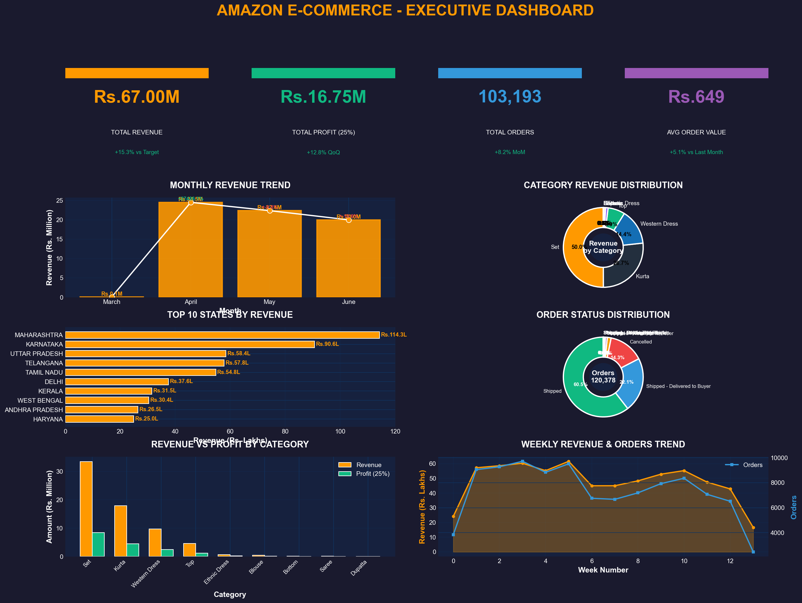
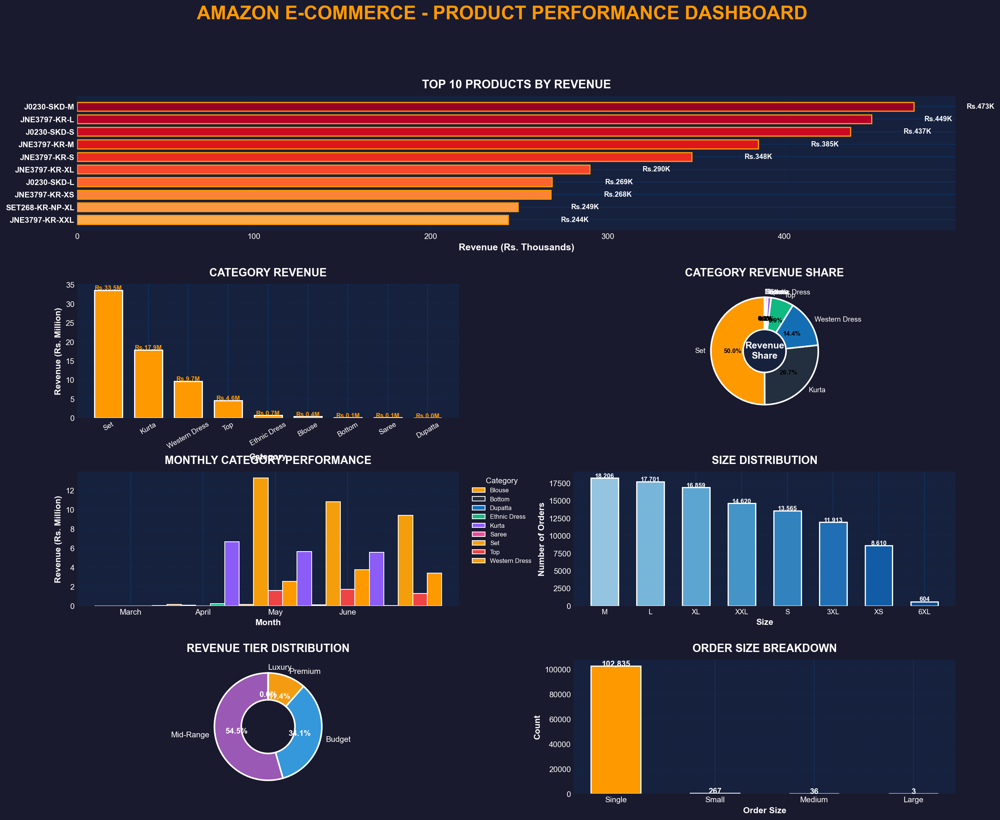
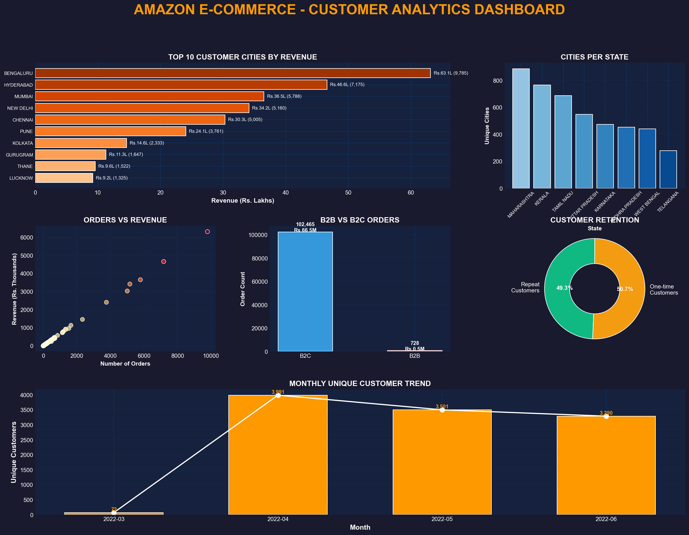

<!-- Amazon Sales Analysis - Interactive README -->
<a name="readme-top"></a>

[](https://github.com/yourusername/Amazon_Sales_Analysis/stargazers)
[](https://github.com/yourusername/Amazon_Sales_Analysis/network/members)
[](https://github.com/yourusername/Amazon_Sales_Analysis/issues)
[](LICENSE)
[](https://www.python.org/)
[](https://github.com/yourusername/Amazon_Sales_Analysis/commits/main)

<div align="center">

# 🚀 Amazon E-Commerce Sales Analysis

*A comprehensive data analysis project featuring interactive dashboards, KPI visualizations, and business insights*



</div>

---

## 📋 Table of Contents

- [📌 Overview](#-overview)
- [🎯 Key Features](#-key-features)
- [🛠️ Tech Stack](#️-tech-stack)
- [📊 Dashboards](#-dashboards)
- [📈 KPIs Analyzed](#-kpis-analyzed)
- [📁 Project Structure](#-project-structure)
- [⚡ Quick Start](#-quick-start)
- [📊 Sample Visualizations](#-sample-visualizations)
- [🔧 Configuration](#-configuration)
- [🤝 Contributing](#-contributing)
- [📄 License](#-license)

---

## 📌 Overview

This project provides a comprehensive analysis of Amazon e-commerce sales data, featuring:

- 📊 **Interactive Dashboards** - Dynamic KPI visualization with real-time filtering
- 🔍 **Data Cleaning** - Python-powered data preprocessing and quality assurance
- 📈 **Business Intelligence** - 40+ KPI formulas for strategic decision-making
- 🗺️ **Regional Analysis** - State-wise and city-wise performance insights
- 📦 **Product Analytics** - Category and SKU performance tracking
- 👥 **Customer Insights** - Customer segmentation and retention analysis

---

## 🎯 Key Features

| Feature | Description |
|---------|-------------|
| 🧹 **Data Cleaning** | Automated data preprocessing with duplicate handling, missing value treatment |
| 📊 **Static Dashboards** | Matplotlib-based executive, product, customer, regional & operational dashboards |
| 📈 **KPI Dashboard** | Key Performance Indicators with trend analysis |
| 🗄️ **SQL Analytics** | Complex business queries with window functions and aggregations |
| 🔬 **Business Impact** | ROI, profit margin, and growth rate calculations |
| 📋 **Portfolio Ready** | Interview-ready documentation and case studies |

---

## 🛠️ Tech Stack

### Languages & Libraries
```
Python          │  Data Processing & Visualization
├── pandas      │  Data manipulation & analysis
├── numpy       │  Numerical computing
├── matplotlib  │  Static dashboard creation
├── plotly      │  Interactive visualizations
└── streamlit   │  Web dashboard (optional)

SQL             │  Database queries & business analysis
├── MySQL       │  Database management
└── Window Func │  Advanced analytics
```

### Tools Used
- **Jupyter/VS Code** - Development environment
- **MySQL Workbench** - Database management
- **Git** - Version control

---

## 📊 Dashboards

| Dashboard | Description | File |
|-----------|-------------|------|
| 🏆 **Executive** | High-level overview with revenue, profit, orders | `executive_dashboard.png` |
| 📦 **Product** | Category & SKU performance analysis | `product_dashboard.png` |
| 👥 **Customer** | Customer segmentation & retention | `customer_dashboard.png` |
| 🗺️ **Regional** | State & city-wise performance | `regional_dashboard.png` |
| 🚚 **Operational** | Fulfillment & delivery metrics | `operational_dashboard.png` |
| 📈 **KPI** | Key Performance Indicators | `kpi_dashboard.png` |

---

## 📈 KPIs Analyzed

### Core Financial KPIs
- 💰 Total Revenue
- 💵 Total Profit (25% margin)
- 📊 Average Order Value (AOV)
- 📦 Total Orders
- 📈 Profit Margin %

### Growth KPIs
- 📈 Month-over-Month (MoM) Growth
- 📈 Year-over-Year (YoY) Growth
- 📈 Quarter-over-Quarter (QoQ) Growth

### Customer KPIs
- 👥 Unique Customer Count
- 🔄 Repeat Customer Rate
- 💎 Customer Lifetime Value (CLV)
- 📊 Customer Contribution %

### Operational KPIs
- 🚚 Delivery Success Rate
- ❌ Cancellation Rate
- ⏱️ Average Delivery Time
- 📦 Order Fulfillment Rate

### Regional KPIs
- 🗺️ Regional Contribution %
- 📊 State Revenue Share
- 🏆 Top 10 States Performance

---

## 📁 Project Structure

```
Amazon_Sales_Analysis/
├── 📂 Raw/
│   └── Amazon Sale Report.csv          # Original raw data
│
├── 📂 cleaned_data/
│   └── amazon_sales_cleaned.csv        # Preprocessed data
│
├── 📂 dashboards/
│   ├── executive_dashboard.png          # Executive overview
│   ├── product_dashboard.png           # Product analytics
│   ├── customer_dashboard.png          # Customer insights
│   ├── regional_dashboard.png          # Regional analysis
│   ├── operational_dashboard.png       # Operations metrics
│   └── kpi_dashboard.png               # KPI visualization
│
├── 📂 reports/
│   ├── data_quality_report.csv         # Data quality metrics
│   ├── missing_value_report.csv        # Missing value analysis
│   └── duplicate_summary.csv           # Duplicate records
│
├── 📂 Python Scripts/
│   ├── 01_python_data_cleaning.py      # Data cleaning script
│   ├── 09_matplotlib_dashboards.py    # Static dashboards
│   └── 10_kpi_dashboard.py             # KPI dashboard
│
├── 📂 SQL Scripts/
│   ├── 02_sql_database_creation.sql    # Database setup
│   ├── 03_sql_business_analysis.sql    # Business queries
│   └── 04_kpi_formulas.sql             # KPI calculations
│
├── 📂 Documentation/
│   ├── 06_business_impact_analysis.md # Business case studies
│   ├── 07_portfolio_resume_documentation.md # Portfolio tips
│   └── 08_interview_preparation.md     # Interview Q&A
│
└── 📄 README.md                        # This file
```

---

## ⚡ Quick Start

### 1. Clone the Repository
```bash
git clone https://github.com/yourusername/Amazon_Sales_Analysis.git
cd Amazon_Sales_Analysis
```

### 2. Install Dependencies
```bash
pip install pandas numpy matplotlib plotly streamlit
```

### 3. Run Data Cleaning
```bash
python 01_python_data_cleaning.py
```

### 4. Generate Dashboards
```bash
python 09_matplotlib_dashboards.py
python 10_kpi_dashboard.py
```

### 5. (Optional) Interactive Dashboard
```bash
# Only if you created streamlit version
streamlit run 10_dynamic_kpi_dashboard.py
```

---

## 📊 Sample Visualizations

### Executive Dashboard


### Product Performance


### Customer Analytics


---

## 🔧 Configuration

### Database Setup (MySQL)
```sql
-- Create database
CREATE DATABASE amazon_sales_db;
USE amazon_sales_db;

-- Run database creation script
SOURCE 02_sql_database_creation.sql;
```

### Data Source
- **File**: `Raw/Amazon Sale Report.csv`
- **Records**: ~128,000+ transactions
- **Date Range**: April-June 2022

---

## 🤝 Contributing

Contributions are welcome! Please feel free to submit a Pull Request.

1. 🍴 Fork the repository
2. 🌿 Create your feature branch (`git checkout -b feature/AmazingFeature`)
3..Commit your changes (`git commit -m 'Add some AmazingFeature'`)
4. 📤 Push to the branch (`git push origin feature/AmazingFeature`)
5. 🔍 Open a Pull Request

---

## 📄 License

This project is licensed under the MIT License - see the [LICENSE](LICENSE) file for details.

---

## 👨‍💻 Author

**Your Name**
- 🔗 [LinkedIn](https://linkedin.com/in/yourprofile)
- 🐦 [Twitter](https://twitter.com/yourhandle)
- 📧 your.email@example.com

---

<div align="center">

⭐ **Star this repository if you found it helpful!** ⭐

[Back to Top](#readme-top)

</div>